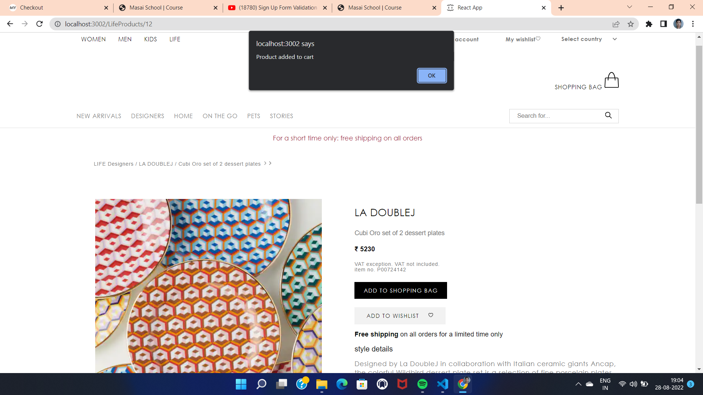

# Mytheresa Website Clonning
Mytheresa is a German e-commerce luxury fashion company.It is an online shopping destination for children's, men's, and women's luxury fashion and lifestyle design.

### [click here to run live demo]()

## Tech Stack used :

* **HTML**
* **CSS**
* **JAVASCRIPT**
* **REACT JS**

## Landing Page:
- The landing page of mytheresa displays various products, offers and ads of their own.
- In top section there is navbar from which we can browse to other pages.
- At the bottom section there is a footer, both header and footer are same across all the pages.

## Footer page :

## Login page :

- user can login by clicking on my account from navbar section.

## Products page :

- Designed two pages-
  1. Life section
  2. Kids section
- By clicking on Life section and kids section on top of the navabr user can go to products page.
- Used sorting and pagination.
- Used json-server local host for fetching data, Post and delete data. 

## Details page :

## Cart page : 

- User can increase or decrease quatity of product and can also remove products from cart.

## Address page :

## Payment page :

## Successful page :

## Learnings :
- Real-life implementation of HTML, CSS, advanced Javascript and React JS.
- Time-management and Accountability.
- Learn to work in pressure.
- Learn to tackle problems and how to keep our-self motivated.

## Links :
- **Github** : https://github.com/rohiniee0028
- **Email** : rohini19394@gmail.com
- **LinkedIn** : https://www.linkedin.com/in/rohini-kushwaha-735b9322b/

 

